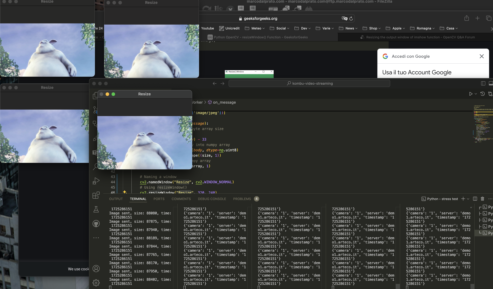
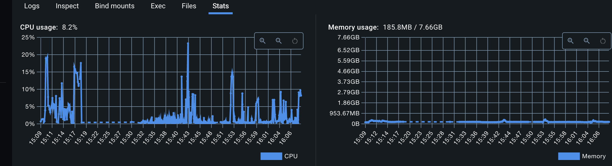

#streaming

Streaming video using rabbitMQ and a static FullHD video on a fanout queue

Rmq on docker (macos):

saver.py -> save snapshot every 1 second
consumer.py -> consume video queue
producer.py -> generate video on queue
multi.sh -> run multiple istance of consumer.py